# Ensuring Quality Releases

This project demonstrates the automation of deploying a demo REST API on Microsoft Azure using Azure App Service and executing automated tests against the API. The infrastructure is provisioned using Terraform, and a CI/CD pipeline is set up for seamless integration and testing.

## How to use?
- Fork this repository to your Github account and clone it locally 

### Depencies
For this you'll need to install the following depencies

- Azure CLI
- Terraform
- JMeter
- Postman
- Python
- Selenium
- Chromedriver
- Chrome

### Instructions

You'll need to login in to your azure account before starting in any terminal you have open, it can be in your own cdm

```
az login
```

In this repository we will be using the azure credentials proporcionated by udacity, so, we'll be using the azure resource group that already exists Azuredevops

## Run packer image for the vm

First, you need to update the variable defined in packer-image.json, you''ll need to replace:

```
    "subscription_id": "",
    "tenant_id": "",
    "client_id": "",
    "client_secret": "",   
    "resource_group_name": "",
    "image_name": "",
    "vm_size": ""
```

After that, you just have to run the following code:
```
packer build ./packer-image.json
```


## Configure the storage account and state backend 

- First, run the script create-tf-storage.sh

```
bash create-tf-storage.sh
```
- Then replace the values in terraform/main.tf with the output from running the create-tf-storage.sh

```
terraform {
    backend "azurerm" {
        storage_account_name = ""
        container_name       = "tfstate"
        key                  = "test.terraform.tfstate"
        access_key           = ""
    }
}
```

## Configure terraform

- Update the values in terraform.tfvars
- Generate an SSH keys in azure command shell
```
ssh-keygen -t rsa
cat ~/.ssh/id_rsa.pub
```
- Put the keys in terraform/modules/vm/vm.tf
```
  admin_ssh_key {
    username   = var.vm_admin_username
    public_key = "" 
  }
```

## Executing terraform

- First you'll need to create a new project
- Then create a PAT and copy it to used it later
- Make a new service connection
- Create an agent pool with access to all pipelines, add this agent to a vm
- Create an enviroment and provide it to a different vm that the one used in the previus step
- Finally create a new pipeline, selecting the GitHub repository of this project, and for the yaml select azure-pipelines.yaml

Update the terraform variables with the ones created in those steps:

```
variables:
  python.version: ''
  azureServiceConnectionId: ''
  projectRoot: $(System.DefaultWorkingDirectory)
  environmentName: ''
  tfstatenumber: '' 
  tfrg: ''
  application_type: ''  
```

- Build FakeRestAPI artifact by archiving the entire FakeRestAPI directory into a zip file and publishing the pipeline artifact to the artifact staging directory

- Deploy the FakeRestAPI to the terraform deployed Azure App Service, the url will be
```http://[yourusername]-fakerestapi-appservice.azurewebsites.net/``` 

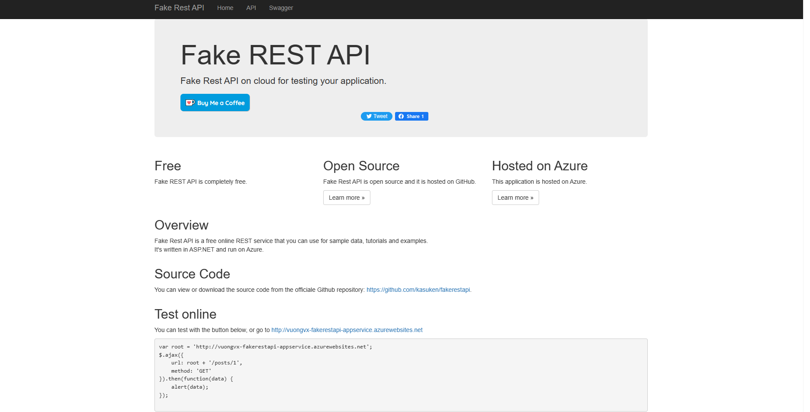

### Automated testing

#### Integration testing postman

- Data validation test
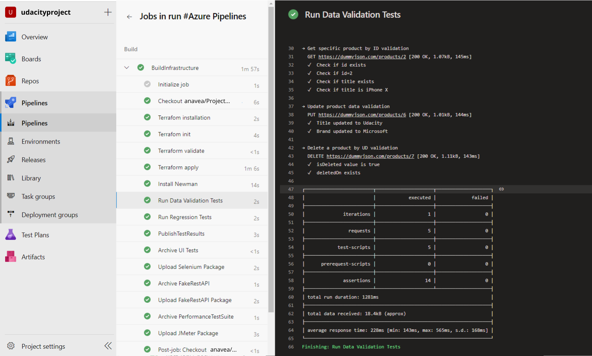
- Regression test
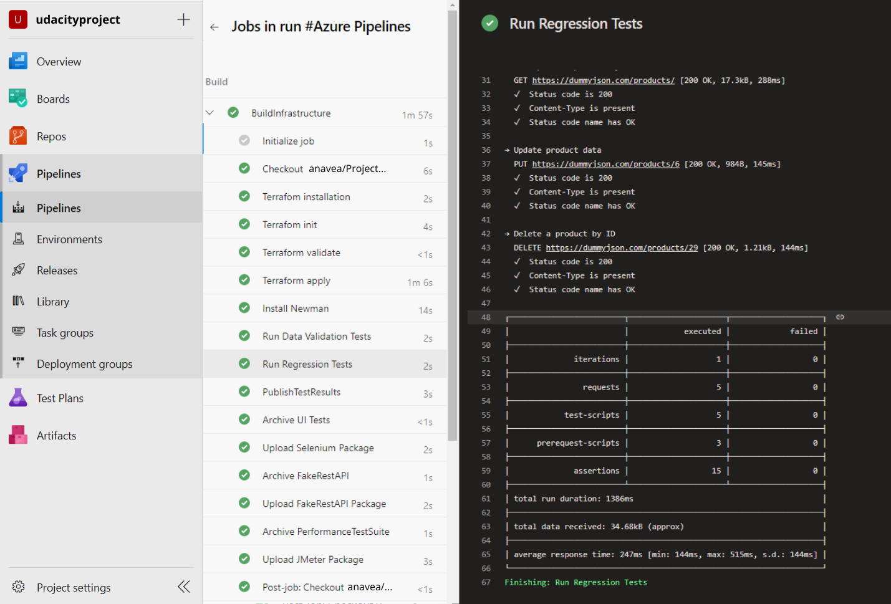

#### Performance testing jmeter

- Stress test
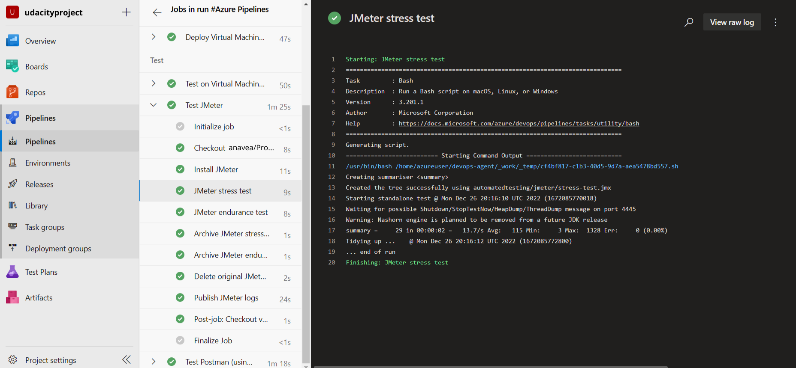
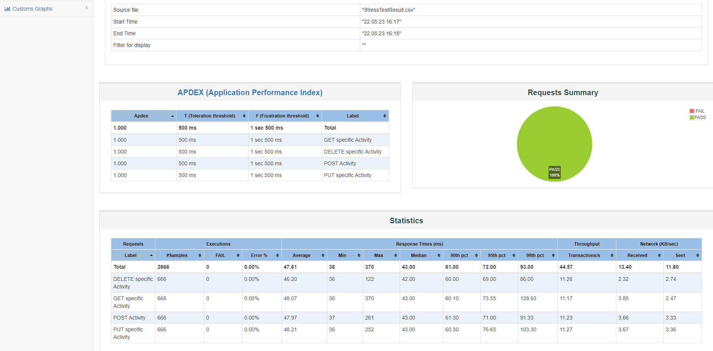
- Endurance test
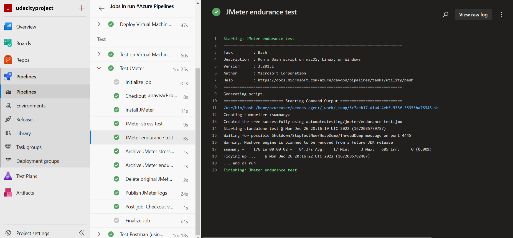
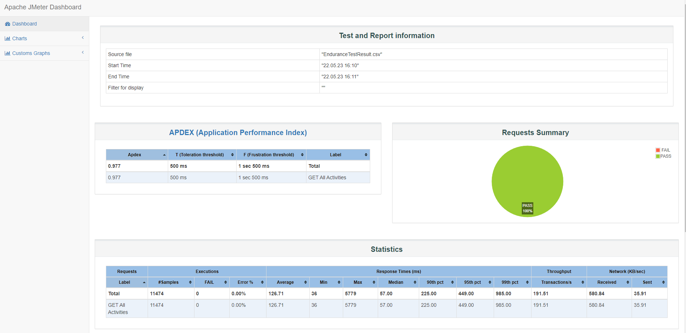
#### Functional UI testing selenium
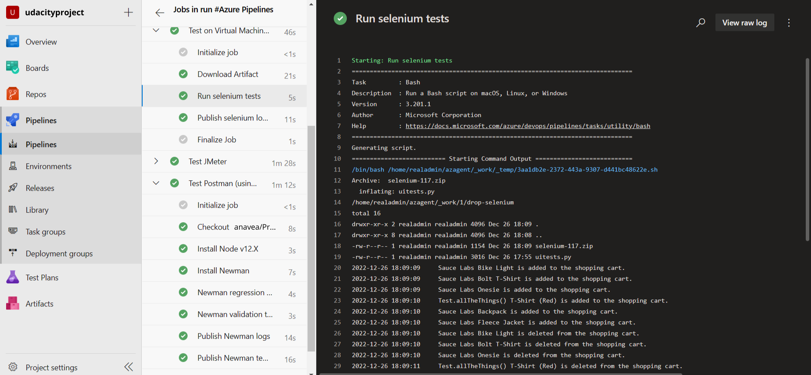

The pipeline execution should look like this

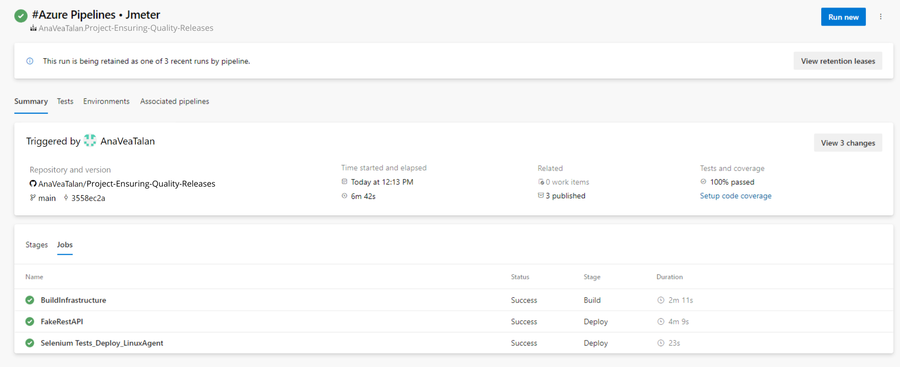

## Monitoring and Observability

- Go to the Azure Portal and create a new alert in the monitoring group, then execute the pipeline to trigger an alert

Monitor chart
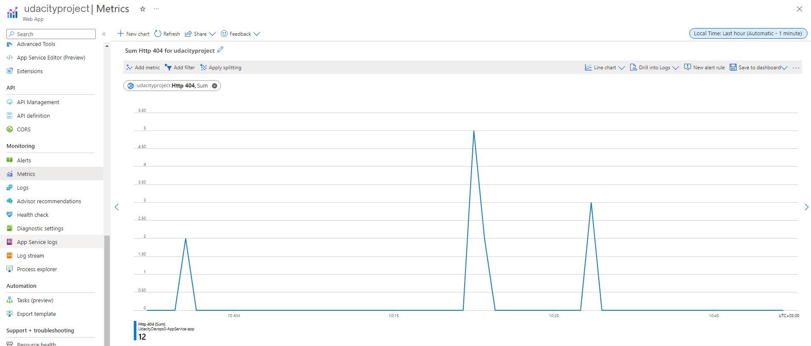

Trigger email alert

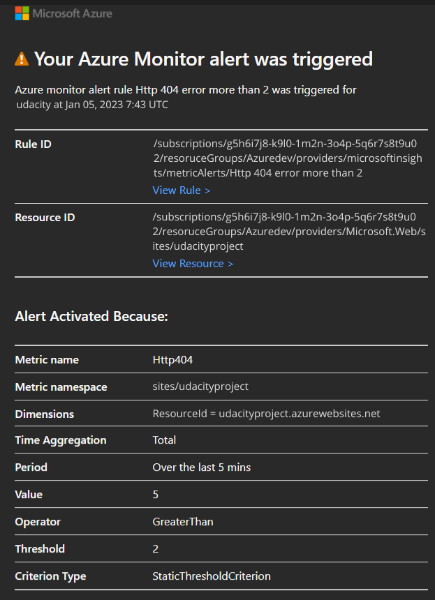


#### Querying custom logs
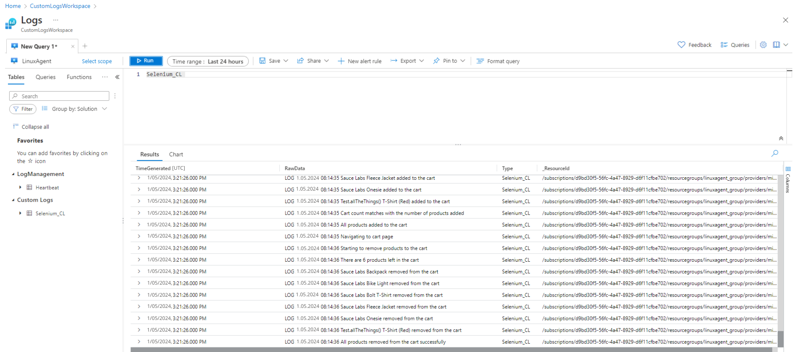

## Suggestions and Corrections
Feel free to submit PRs to this repo should you have any proposed changes. 
